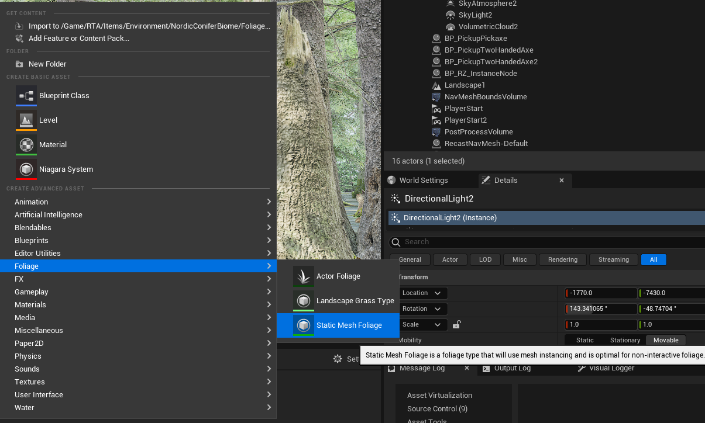
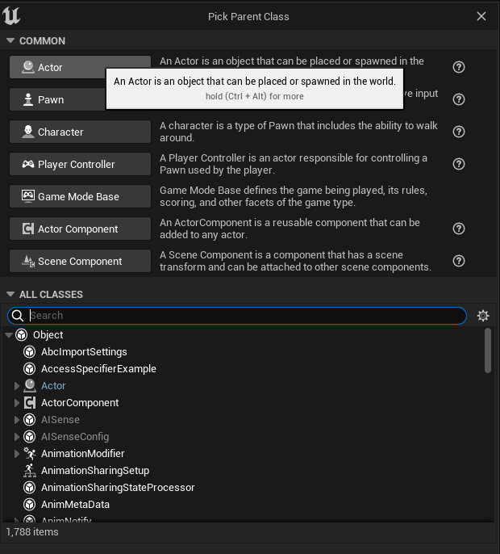
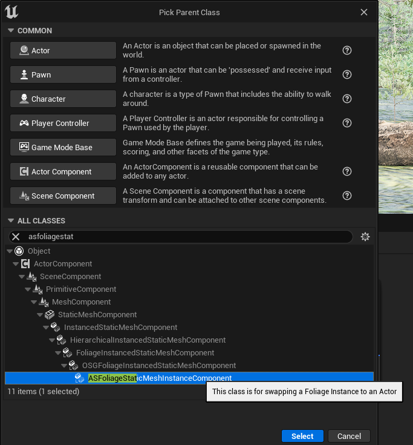
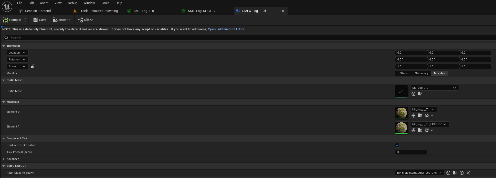
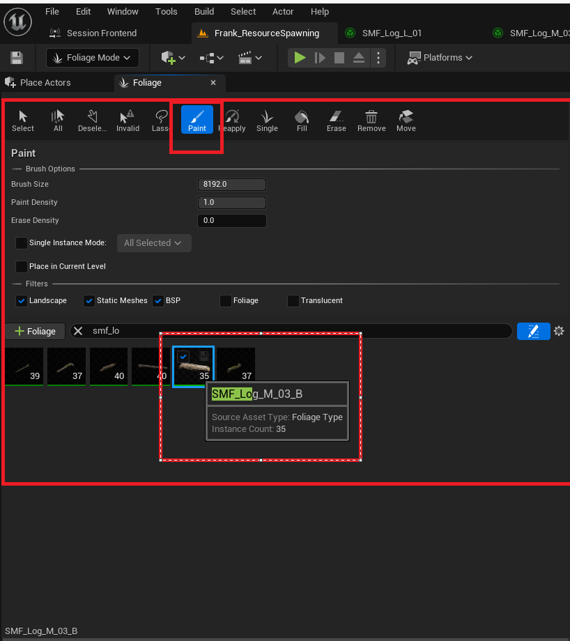

# Foliage Instance Tutorial

     
## This is the tutorial to show you how to make a foliage instance that converts to a blueprint when the character gets close enough to the instance

# Table of Contents
1. [Create Static Mesh Foliage](#Create-Static-Mesh-Foliage)
2. [Create an Actor Blueprint](#Create-an-Actor-Blueprint)
3. [Create Static Mesh Foliage Component](#Create-Static-Mesh-Foliage-Component)
4. [Link Foliage Component to Blueprint](#Link-Foliage-Component-to-Blueprint)
5. [Paint](#Paint)

## 1. Create Static Mesh Foliage
### Right Click in the content browser and select "Static Mesh Foliage"

## 2. Create an Actor Blueprint
### Create an Actor Blueprint that is derived from OSGBaseItemGather
### Note: The Foliage Instance Component only alows linking for classes that derive From OSGBaseItemGather

     
## 3. Create Static Mesh Foliage Component
### Create a ASFoliageStaticMeshInstanceComponent
### This Instance Component will link the blueprint to the Static Mesh Foliage

## 3. Link Foliage Component to Blueprint

## 4. Paint
1. Select Foliage Tool

2. Drage Newly Created Foliage into Pallet

3. Paint

 

