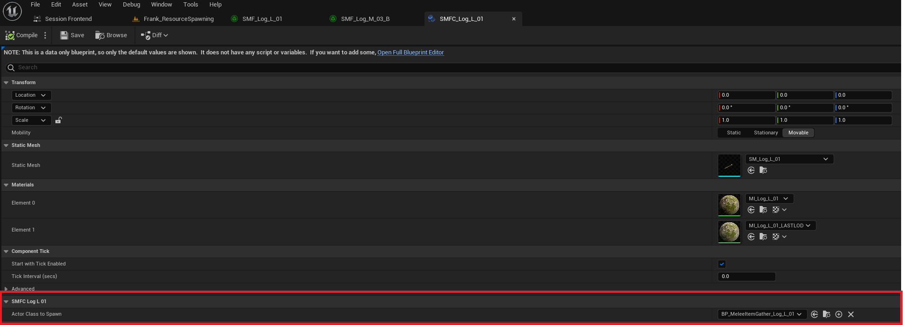

# Foliage Instance Tutorial

     
## This is the tutorial to show you how to make a foliage instance that converts to a blueprint when the character gets close enough to the instance

### Naming Prefixes
#### SMFC_ - Static Mesh Foliage Component
#### SMF_  - Static Mesh Foliage

# Table of Contents
1. [Create Static Mesh Foliage](#Create-Static-Mesh-Foliage)
2. [Create an Actor Blueprint](#Create-an-Actor-Blueprint)
3. [Create Static Mesh Foliage Component](#Create-Static-Mesh-Foliage-Component)
4. [Link Foliage Component](#Link-Foliage-Component)
5. [Paint](#Paint)
6. [Summary](#Summary)

# 1
## Create Static Mesh Foliage
### 1. Right Click in the content browser and select "Static Mesh Foliage"
### 2. Open the asset and add the mesh in the dropdown
### *Note: This Mesh will be the same as the blueprint you will create in step 2

### 3. Adjust Collision Settings

### Done

# 2
## Create an Actor Blueprint
### 1. Create an Actor Blueprint that is derived from OSGBaseItemGather
### *Note: The Foliage Instance Component only alows linking for classes that derive From OSGBaseItemGather
### *Note: Use the same Mesh you used to create the Static Mesh Foliage in step 1
### Done

     
## 3. Create Static Mesh Foliage Component
### 1. Create a ASFoliageStaticMeshInstanceComponent
### Note: This Instance Component will link the blueprint to the Static Mesh Foliage

### 2. Adjust Collision Settings

# 3
## Link Foliage Component to Foliage and Blueprint
### 1. Open the Static Mesh Foliage you created in step 1
### 2. Look for "Component Class"
### 3. Select the Static Mesh Foliage Component you created
### Done

### 4. Link-Foliage-Component-to-Blueprint
### 5. Open The Static Mesh Foliage Component
### Look for "Actor Class to Spawn"
### Note: The Options for which actors can be selected are only classes of "OSGBaseItemGather"

# 5
## Paint
### 1. Select Foliage Tool

### 2. Drage Newly Created Foliage into Pallet

### 3. Paint
 

# 6
### Summary
 

