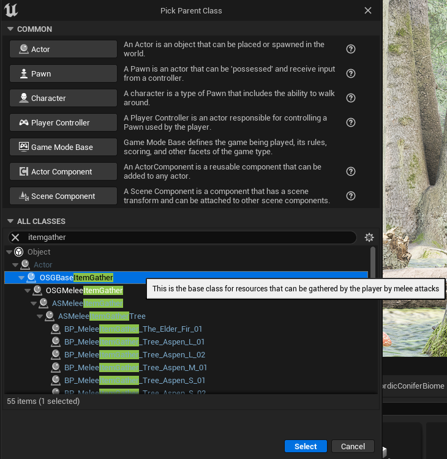

# Foliage Instance Tutorial

     
## This is the tutorial to show you how to make a foliage instance that converts to a blueprint when the character gets close enough to the instance

# Table of Contents
1. [Create Static Mesh Foliage](#Create-Static-Mesh-Foliage)
2. [Create Actor Blueprint](#Createan ctorBlueprintthatisderivedfromOSGBaseItemGathe)
3. [Create Static Mesh Foliage Component](#Create-Static-Mesh-Foliage-Component)
4. [Link Foliage Component to Blueprint](#Link-Foliage-Component-to-Blueprint)

## Create Static Mesh Foliage

## Create an Actor that is derived from OSGBaseItemGather Blueprint

     

## Create Static Mesh Foliage Component

## Link Foliage Component to Blueprint

